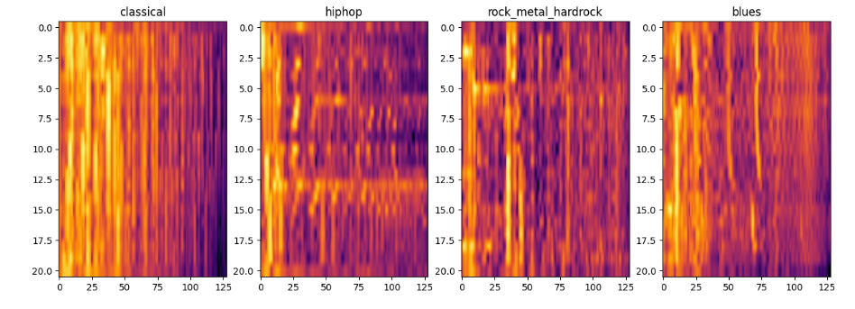
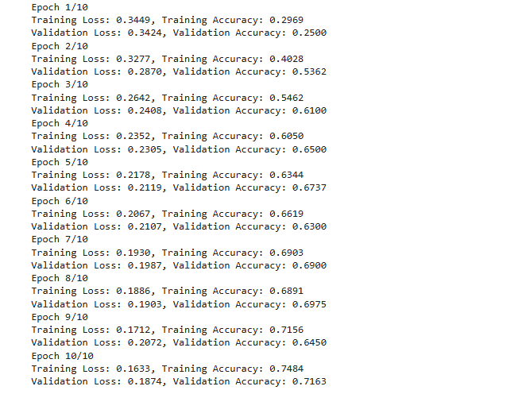
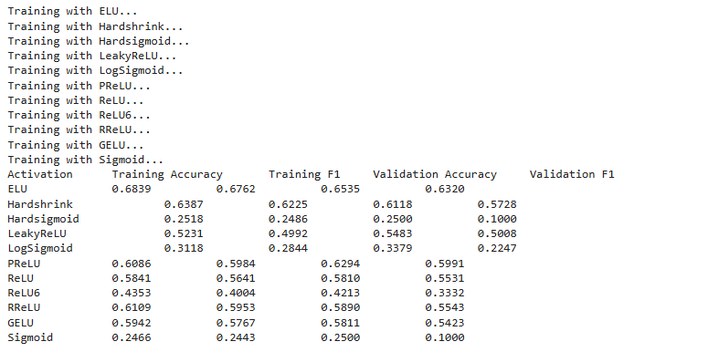
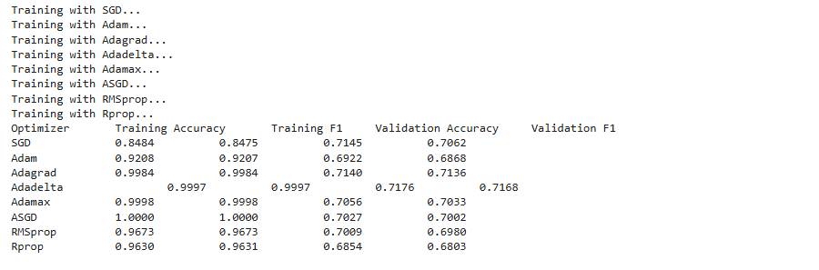
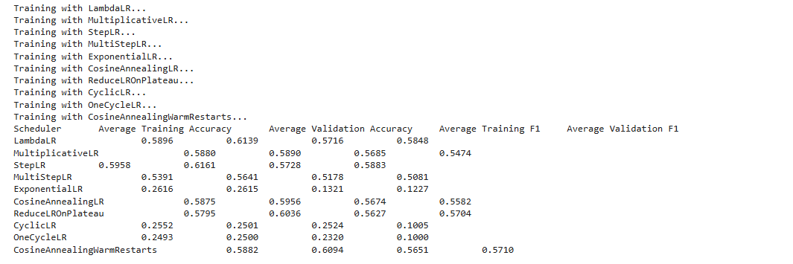
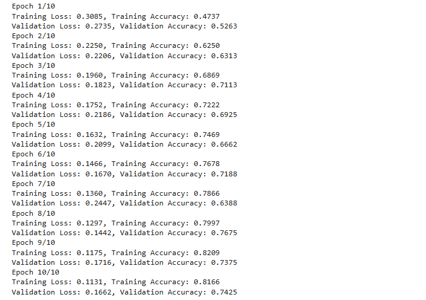

# Music-Genre-Classification-with-Feedforward-Neural-Networks-and-MFCC-Features

This project develops a feedforward neural network to classify music genres using MFCC features. It includes data loading, label mapping, and setting up PyTorch dataloaders for training, validation, and testing, aiming to distinguish genres like classical, hip-hop, rock, and blues.

## Feedforward Neural Network

Creating and training a feedforward neural network to classify music genres using MFCC features.

- **Load MFCC data** for training, validation, and testing, with genres mapped to integers for compatibility with PyTorch

```python
# Load data function
def load_data(path):
    X = np.load(f'{path}/X.npy', allow_pickle=True)
    labels = np.load(f'{path}/labels.npy', allow_pickle=True)
    return X, labels

# Loading training, validation, and test data
X_train, y_train = load_data(train_path)
X_val, y_val = load_data(val_path)
X_test, y_test = load_data(test_path)

# Mapping labels to integers
label_mapping = {"classical": 0, "hiphop": 1, "rock_metal_hardrock": 2, "blues": 3}
y_train = np.vectorize(label_mapping.get)(y_train)
```



- **Fully connected neural network** with three hidden layers and ReLU activation functions

```python
class FullyConnectedNetwork(nn.Module):
    def __init__(self):
        super(FullyConnectedNetwork, self).__init__()
        self.fc1 = nn.Linear(26, 128)
        self.fc2 = nn.Linear(128, 128)
        self.fc3 = nn.Linear(128, 32)
        self.fc4 = nn.Linear(32, 4)
    
    def forward(self, x):
        x = F.relu(self.fc1(x))
        x = F.relu(self.fc2(x))
        x = F.relu(self.fc3(x))
        x = self.fc4(x)
        return x
```

- The **training function** for the model, calculating loss and updating weights

```python
def train_model(model, epochs, optimizer, dataloader, loss_function):
    for epoch in range(epochs):
        model.train()
        for inputs, targets in dataloader:
            optimizer.zero_grad()
            outputs = model(inputs)
            loss = loss_function(outputs, targets)
            loss.backward()
            optimizer.step()
        print(f'Epoch {epoch+1}/{epochs} complete')
    return model
```

- Function to evaluate the model with **accuracy, F1-score**, and a **confusion matrix**

```python
def evaluate(model, dataloader, loss_function):
    model.eval()
    all_predictions, all_targets = [], []
    with torch.no_grad():
        for inputs, labels in dataloader:
            outputs = model(inputs)
            _, preds = torch.max(outputs, 1)
            all_predictions.extend(preds.cpu().numpy())
            all_targets.extend(labels.cpu().numpy())
    accuracy = accuracy_score(all_targets, all_predictions)
    conf_matrix = confusion_matrix(all_targets, all_predictions)
    return accuracy, conf_matrix
```

- Train the network and evaluate it on the test set.

```python
model = FullyConnectedNetwork()
optimizer = torch.optim.SGD(model.parameters(), lr=0.002)
loss_function = torch.nn.CrossEntropyLoss()
trained_model = train_model(model, epochs=30, optimizer=optimizer, dataloader=train_dataloader, loss_function=loss_function)
test_accuracy, test_confusion_matrix = evaluate(trained_model, test_dataloader, loss_function)
```



## Convolutional Neural Network

- Load and visualize spectrogram data for each class.

```python
# Loading and transforming data to PyTorch tensors
X_train, y_train = load_data(train_path)
X_train = torch.from_numpy(X_train.astype('float32')).unsqueeze(1)
```

- CNN with convolutional, pooling, and fully connected layers.

```python
class ConvNet(nn.Module):
    def __init__(self, out_dim):
        super(ConvNet, self).__init__()
        self.conv1 = nn.Conv2d(1, 16, kernel_size=5, padding=2)
        self.pool1 = nn.MaxPool2d(2, 2)
        # Additional layers
        self.fc1 = nn.Linear(128, 1024)
        self.fc4 = nn.Linear(32, out_dim)
    def forward(self, x):
        x = self.pool1(F.relu(self.conv1(x)))
        return x
```

## Improving Model Performance, Reproducibility, and Optimization Techniques

This section evaluates various optimization techniques to improve performance and reproducibility.

- **Reproducibility**

```python
# Set seeds for reproducibility
torch.manual_seed(42)
np.random.seed(42)
```

- **Activation Functions**

Tests alternatives to ReLU, such as LeakyReLU and ELU.

```python
# Dictionary for activation functions
activation_functions = {
    "ELU": nn.ELU(),
    "Hardshrink": nn.Hardshrink(),
    "Hardsigmoid": nn.Hardsigmoid(),
    "LeakyReLU": nn.LeakyReLU(),
    "LogSigmoid": nn.LogSigmoid(),
    "PReLU": nn.PReLU(),
    "ReLU": nn.ReLU(),
    "ReLU6": nn.ReLU6(),
    "RReLU": nn.RReLU(),
    "GELU": nn.GELU(),
    "Sigmoid": nn.Sigmoid()
}

# Dictionary to save results
results = {}
epochs = 10

# for loop for each activation function in the dictionary
for name, activation in activation_functions.items():
    print(f"Training with {name}...")

    model = ConvNet(4, activation).to(device)
    loss_function = nn.CrossEntropyLoss()
    optimizer = torch.optim.SGD(model.parameters(), lr=0.01)

    train_acc_list = []
    train_f1_list = []
    val_acc_list = []
    val_f1_list = []
```

```python
class ModifiedNetwork(nn.Module):
    def __init__(self):
        super(ModifiedNetwork, self).__init__()
        self.fc1 = nn.Linear(26, 128)
        self.fc2 = nn.Linear(128, 128)
        self.fc3 = nn.Linear(128, 32)
        self.fc4 = nn.Linear(32, 4)
    def forward(self, x):
        x = F.leaky_relu(self.fc1(x))
        return x
```




- **Learning Rate Schedulers**

```python
schedulers = {
    "LambdaLR": {"function": lr_scheduler.LambdaLR, "params": {"lr_lambda": lambda epoch: 0.95 ** epoch}},
    "MultiplicativeLR": {"function": lr_scheduler.MultiplicativeLR, "params": {"lr_lambda": lambda epoch: 0.95 ** epoch}},
    "StepLR": {"function": lr_scheduler.StepLR, "params": {"step_size": 30, "gamma": 0.1}},
    "MultiStepLR": {"function": lr_scheduler.MultiStepLR, "params": {"milestones": [30, 80], "gamma": 0.1}},
    "ExponentialLR": {"function": lr_scheduler.ExponentialLR, "params": {"gamma": 0.1}},
    "CosineAnnealingLR": {"function": lr_scheduler.CosineAnnealingLR, "params": {"T_max": 50}},
    "ReduceLROnPlateau": {"function": lr_scheduler.ReduceLROnPlateau, "params": {"mode": 'min', "factor": 0.1, "patience": 10}},
    "CyclicLR": {"function": lr_scheduler.CyclicLR, "params": {"base_lr": 0.01, "max_lr": 0.1}},
    "OneCycleLR": {"function": lr_scheduler.OneCycleLR, "params": {"max_lr": 0.1, "total_steps": epochs}},
    "CosineAnnealingWarmRestarts": {"function": lr_scheduler.CosineAnnealingWarmRestarts, "params": {"T_0": 50}},
}

results = {}

# for loop for each scheduler in the dictionary
for name, scheduler_info in list(schedulers.items())[:10]:
    print(f"Training with {name}...")
    model = ConvNet(out_dim, nn.ReLU()).to(device)

    optimizer = torch.optim.SGD(model.parameters(), lr=0.01)
    scheduler = scheduler_info["function"](optimizer, **scheduler_info["params"])

    train_acc_list = []
    train_f1_list = []
    val_acc_list = []
    val_f1_list = []
```



- **Batch Normalization**

```python
# Adding batch normalization
self.bn1 = nn.BatchNorm1d(128)
def forward(self, x):
    x = self.bn1(F.relu(self.fc1(x)))
    return x
```



## Results Analysis 
- **Feedforward Neural Network Results**
  With MFCCs as input, the feedforward network performs reasonably well, with batch normalization and a learning rate scheduler enhancing model stability and convergence.

- **Convolutional Neural Network Results**
  The CNN on spectrogram data outperforms the feedforward network, with batch normalization and scheduling further improving accuracy and reducing misclassifications.

## Conclusion

This study finds CNNs with spectrogram input to be effective for genre classification. Techniques like batch normalization and learning rate scheduling further refine performance and reproducibility. Future work could explore deeper CNN architectures or recurrent models for improved temporal pattern analysis.
